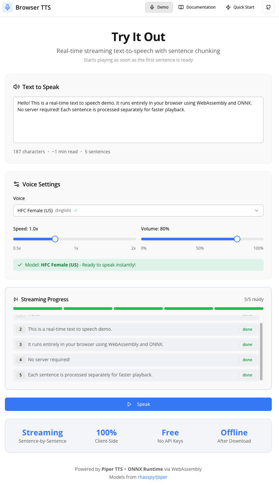

# Browser TTS - Real-time Text to Speech

A high-performance, browser-based text-to-speech system that runs **100% client-side** using WebAssembly and ONNX neural models. This project demonstrates real-time audio synthesis in the browser with streaming playback, multi-core processing, and zero server costs.

**Key Innovation:** Unlike traditional TTS services that require API calls and server costs, this runs entirely in your browser using neural TTS models compiled to WebAssembly. Audio generation happens locally on your machine, with no data sent to external servers.



## Features

- **100% Client-Side** - No server costs, no API keys, runs entirely in the browser using WebAssembly
- **Streaming Playback** - Audio starts playing as the first sentence is ready while the rest generates in the background
- **Multi-Core Processing** - Leverages WebAssembly threads for parallel generation across CPU cores
- **Auto Warm-Up** - Pre-loads models for instant playback when the user clicks speak
- **8 Built-in Voices** - English (US/UK), German, French, and Spanish with natural prosody
- **Offline Support** - Models are cached in the browser, works offline after first download
- **Privacy-First** - All processing happens locally; no data sent to external servers
- **Modern Stack** - React 18, TypeScript, Vite, Tailwind CSS, and shadcn/ui

## What Makes This Different?

Most text-to-speech solutions require:
- **Cloud API calls** (Google Cloud TTS, Amazon Polly) - costs money, requires internet, sends your text to servers
- **Native apps** (macOS `say` command) - platform-specific, no web integration
- **Browser's built-in speech** (`speechSynthesis`) - limited voices, inconsistent quality across browsers

This project uses **neural TTS models** (VITS architecture trained on Piper datasets) compiled to WebAssembly with ONNX Runtime. The entire inference pipeline runs in your browser with performance comparable to cloud services.

## Quick Start

### Installation

```bash
# Clone the repository
git clone https://github.com/davidbmar/Browser-Text-to-Speech-TTS-Realtime.git
cd Browser-Text-to-Speech-TTS-Realtime

# Install dependencies
npm install

# Start development server (default port 5000)
npm run dev

# Or specify a custom port
PORT=3344 npm run dev
```

Open your browser to:
- **Default:** `http://localhost:5000`
- **Custom port:** `http://localhost:3344` (or whatever port you specified)

### First-Time Setup Notes

- **Model Download:** On first use, the browser will download the selected voice model (~20-50MB). This happens once and is cached in your browser's IndexedDB.
- **Cross-Origin Isolation:** The server automatically sets COOP/COEP headers required for multi-threaded WebAssembly.
- **Browser Requirements:** Chrome 89+, Firefox 89+, Safari 15+, or Edge 89+ with WebAssembly support.

### Basic Usage

```tsx
import { useTTS } from "./hooks/use-tts";

function TextToSpeech() {
  const { speak, stop, isPlaying, isReady } = useTTS({
    voiceId: "en_US-hfc_female-medium",
    autoWarmUp: true, // Pre-load model on mount
  });

  return (
    <div>
      <button
        onClick={() => speak("Hello! This text will be spoken out loud.")}
        disabled={!isReady}
      >
        {isReady ? "Speak" : "Loading..."}
      </button>
      {isPlaying && <button onClick={stop}>Stop</button>}
    </div>
  );
}
```

### With Progress Tracking

```tsx
function AdvancedTTS() {
  const {
    speak,
    stop,
    pause,
    resume,
    isPlaying,
    isPaused,
    isGenerating,
    chunks,
    progress
  } = useTTS({
    voiceId: "en_US-hfc_female-medium",
    speed: 1.0,
    volume: 0.8,
    maxConcurrent: 3,
    autoWarmUp: true,
  });

  return (
    <div>
      <button onClick={() => speak("Long text with multiple sentences. Each one generates separately. You'll hear audio before it's all done!")}>
        Speak
      </button>

      <p>Progress: {progress.current}/{progress.total} sentences ready</p>

      <div>
        {chunks.map((chunk, i) => (
          <span key={i} style={{
            color: chunk.status === 'playing' ? 'green' :
                   chunk.status === 'ready' ? 'blue' : 'gray'
          }}>
            {chunk.text}
          </span>
        ))}
      </div>
    </div>
  );
}
```

## Documentation

- [Quick Start Guide](QUICK_START.md) - Get started in 5 minutes
- [Setup Guide](SETUP.md) - Detailed installation and configuration
- [API Reference & Developer Docs](replit.md) - Architecture and technical details
- [Improvements Roadmap](IMPROVEMENTS.md) - Suggested enhancements and future features
- [Contributing Guidelines](CONTRIBUTING.md) - How to contribute

## API Reference

### `useTTS(options)`

React hook for text-to-speech functionality.

#### Options

| Option | Type | Default | Description |
|--------|------|---------|-------------|
| `voiceId` | string | `"en_US-hfc_female-medium"` | Voice model to use |
| `speed` | number | `1.0` | Playback speed (0.5 to 2.0) |
| `volume` | number | `0.8` | Volume level (0 to 1) |
| `maxConcurrent` | number | `2` | Max parallel sentence generation |
| `autoWarmUp` | boolean | `false` | Pre-load model on mount for instant playback |

#### Returns

**Methods:**

| Method | Description |
|--------|-------------|
| `speak(text)` | Start speaking the given text |
| `stop()` | Stop all playback and generation |
| `pause()` | Pause current playback |
| `resume()` | Resume paused playback |
| `warmUp()` | Manually pre-load and initialize the model |
| `setSpeed(n)` | Change speed during playback (0.5-2.0) |
| `setVolume(n)` | Change volume during playback (0-1) |

**State:**

| Property | Type | Description |
|----------|------|-------------|
| `isPlaying` | boolean | Currently playing audio |
| `isPaused` | boolean | Playback is paused |
| `isGenerating` | boolean | Generating audio chunks |
| `isDownloading` | boolean | Downloading voice model |
| `isWarmingUp` | boolean | Initializing WASM runtime |
| `isReady` | boolean | Model loaded, ready for instant playback |
| `downloadProgress` | number | Download progress (0-100) |
| `chunks` | TTSChunk[] | Array of sentence chunks with status |
| `progress` | object | `{ current, total }` sentences ready |

### Available Voices

| Voice ID | Language | Description |
|----------|----------|-------------|
| `en_US-hfc_female-medium` | English (US) | HFC Female - Clear, natural |
| `en_US-hfc_male-medium` | English (US) | HFC Male - Deep, professional |
| `en_US-libritts_r-medium` | English (US) | LibriTTS - Audiobook style |
| `en_GB-alba-medium` | English (UK) | Alba - British female |
| `en_GB-aru-medium` | English (UK) | Aru - British accent |
| `de_DE-thorsten-medium` | German | Thorsten - German male |
| `fr_FR-siwis-medium` | French | Siwis - French female |
| `es_ES-davefx-medium` | Spanish | DaveFX - Spanish male |

## Architecture

### How Streaming Works

1. **Text Splitting** - Input text is split into sentences
2. **Parallel Generation** - Multiple sentences generate simultaneously (configurable)
3. **Sequential Playback** - Audio plays in order as chunks become ready
4. **Memory Management** - Blob URLs are cleaned up after playback

```
Input: "Hello world. How are you? I'm doing great."

Generation:  [Sentence 1]---->[Ready]
             [Sentence 2]------->[Ready]
             [Sentence 3]---------->[Ready]

Playback:    [Playing 1][Playing 2][Playing 3]
                        ↑ Audio starts here, before all sentences are ready
```

### Cross-Origin Isolation

For multi-core WASM threading, the server must send these headers:

```javascript
app.use((req, res, next) => {
  res.setHeader("Cross-Origin-Opener-Policy", "same-origin");
  res.setHeader("Cross-Origin-Embedder-Policy", "require-corp");
  next();
});
```

### File Structure

```
├── client/
│   ├── src/
│   │   ├── hooks/
│   │   │   └── use-tts.ts       # React hook wrapper
│   │   ├── lib/
│   │   │   └── tts-engine.ts    # Core TTS engine
│   │   └── pages/
│   │       ├── home.tsx         # Demo app
│   │       ├── docs.tsx         # API documentation
│   │       └── quickstart.tsx   # Getting started guide
├── server/
│   └── index.ts                 # Express server with COOP/COEP headers
└── shared/
    └── schema.ts                # Shared types
```

## Performance Tips

1. **Enable Auto Warm-Up** - Set `autoWarmUp: true` to pre-load models
2. **Increase Concurrency** - Set `maxConcurrent: 3-4` for faster generation
3. **Cache Models** - Models are cached in browser IndexedDB after first download
4. **Use Appropriate Voice** - "medium" quality voices balance size and quality

## Browser Support

- Chrome 89+ (recommended)
- Firefox 89+
- Safari 15+
- Edge 89+

Requires WebAssembly and Web Audio API support.

## Tech Stack

- **Frontend**: React 18, TypeScript, Vite, Tailwind CSS, shadcn/ui
- **Backend**: Express, TypeScript (ESM)
- **TTS Engine**: @diffusionstudio/vits-web (WebAssembly/ONNX)
- **State Management**: TanStack React Query

## Development

```bash
# Run TypeScript type checking
npm run check

# Build for production
npm run build

# Start production server (default port 5000)
npm start

# Start production server on custom port
PORT=8080 npm start
```

### Environment Variables

| Variable | Default | Description |
|----------|---------|-------------|
| `PORT` | `5000` | Server port for both API and client |
| `NODE_ENV` | `development` | Set to `production` for optimized builds |

### Troubleshooting

**Server won't start:**
- Make sure port 5000 (or your custom port) isn't already in use
- On macOS, the `reusePort` option is not supported (fixed in latest version)

**Models not loading:**
- Check browser console for CORS errors
- Ensure COOP/COEP headers are being set (automatic in this server)
- Try clearing browser cache and reloading

**Poor audio quality:**
- Increase the quality level (try "high" quality models if available)
- Adjust the speed setting (values closer to 1.0 are more natural)
- Try a different voice model

## Credits

- [Piper TTS](https://github.com/rhasspy/piper) - VITS neural TTS models
- [@diffusionstudio/vits-web](https://github.com/nicholasgcoles/vits-web) - WebAssembly bindings
- [ONNX Runtime Web](https://github.com/microsoft/onnxruntime) - ML inference in browser

## License

MIT License - feel free to use in personal and commercial projects. See [LICENSE](LICENSE) for details.
